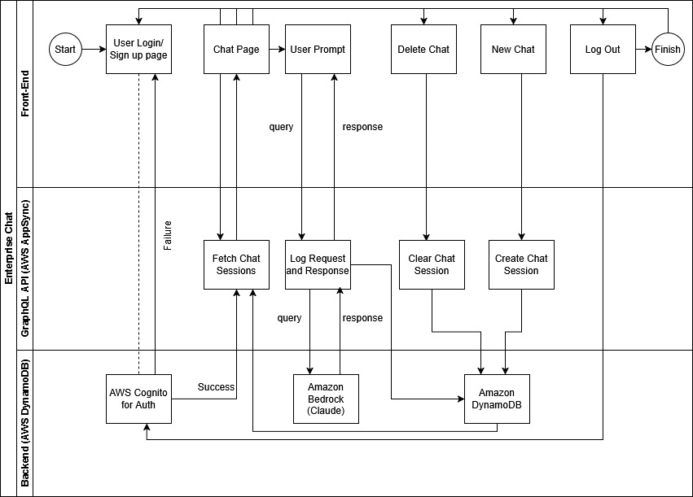
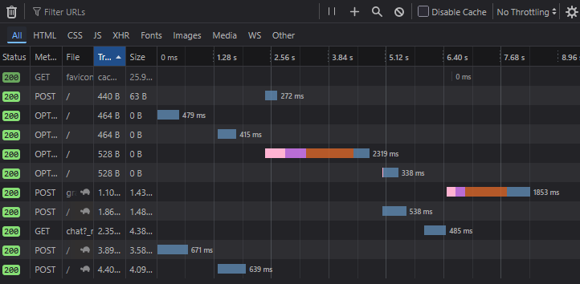
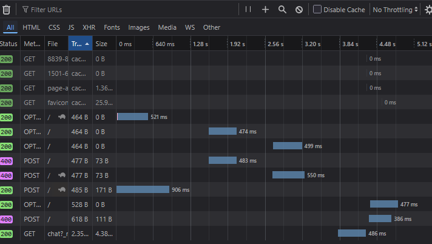
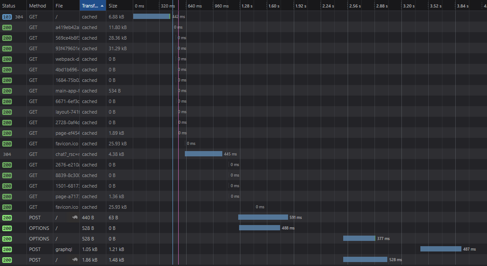
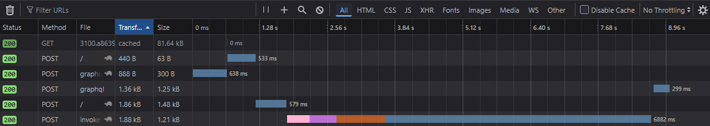
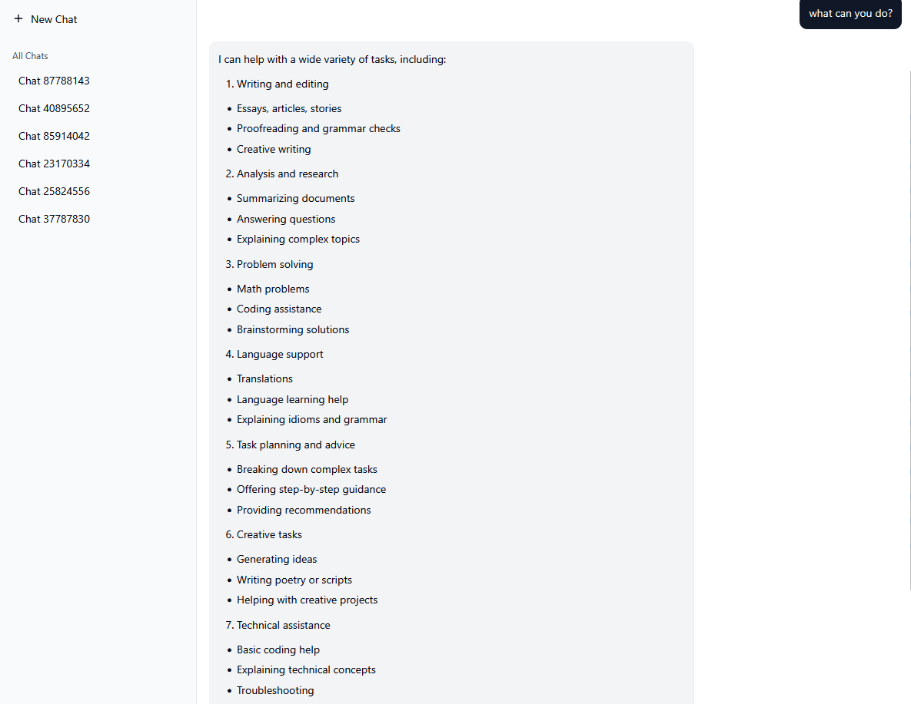

# Enterprise-AI-Chat-App
This code contains the code used for the React front end of an enterprise chat app

**Note:** If using this application via the URL and signing up, please ensure the email has been verified before attempting to login.

## Introduction
The website for this project can be found [here](https://enterprise-ai-chat-app-abz6.vercel.app/login).

## High Level Design Diagram

The frontend of this website was built in React, the application is deployed on Vercel and calls a variety of AWS services to perform all the necessary actions including AWS AppSync (for the GraphQL API), Amazon DynamoDB (for the storing the chats), AWS Cognito (authentication), and Amazon Bedrock (for the Claude LLM)

## Security
Security was primarily handled through AWS as we used Cognito. All other sensitive AWS environment information was handled using environment variables so that it is harder to compromise.

Furthermore, emails are required to be verified before logging in which AWS Cognito also handles.

## Deployment
In terms of deployment, a production build of this application was performed through the below command:
```(bash)
npm run build
```
This was then deployed onto Vercel by linking this GitHub repository.

## Performance Analysis

Below are some of the front-end response times in various scenarios:

Logging in and chat fetching

Logging in only takes about 1.5s, fetching all the chats certainly takes quite a bit of time, and could be optimized.

Signing Up

It takes ~5s for the sign up to complete but within a second, the verification email is sent.

Fetching all chats for a logged in user:

~4s response to fetch 5 chats which weren't very long, therefore there is definitely room for optimization.

Large Prompt response:

~7s delay in the response for the following query:


In terms of the backend, there wasn't any concrete findings regarding the latency of the backend AWS systems but it certainly adds overhead which can be reduced. One of the recommended strategies to reduce latency is to batch requests.

Due to the high reliance on AWS services, this application supports elasticity as it automatically scales resources as necessary.